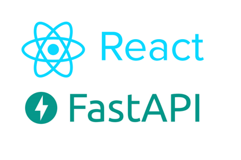

<!-- Improved compatibility of back to top link: See: https://github.com/othneildrew/Best-README-Template/pull/73 -->
<a id="readme-top"></a>
<!--
*** Thanks for checking out the Best-README-Template. If you have a suggestion
*** that would make this better, please fork the repo and create a pull request
*** or simply open an issue with the tag "enhancement".
*** Don't forget to give the project a star!
*** Thanks again! Now go create something AMAZING! :D
-->


<!-- PROJECT LOGO -->
<br />
<div align="center">
  <a href="https://github.com/ARogers99/CVRecommenderProject">
    
  </a>

<h3 align="center">CVRecommenderProject</h3>

  <p align="center">
    A CV recommender project made using React and FastAPI, with calls to Anthropics Claude LLM and JSearch API. Users upload CV, The CV is parsed and best matches are scored 0-1 against available jobs.
    The highest scoring matches, those greater than 0.2 score, are then passed to Claude which suggests changes to user CV to increase match scores.
    <br />
    <a href="https://github.com/ARogers99/CVRecommenderProject"><strong>Explore the docs »</strong></a>
    <br />
    <br />
    <a href="https://github.com/ARogers99/CVRecommenderProject/issues/new?labels=bug&template=bug-report---.md">Report Bug</a>
    &middot;
    <a href="https://github.com/ARogers99/CVRecommenderProject/issues/new?labels=enhancement&template=feature-request---.md">Request Feature</a>
  </p>
</div>


<!-- TABLE OF CONTENTS -->
<details>
  <summary>Table of Contents</summary>
  <ol>
    <li>
      <a href="#about-the-project">About The Project</a>
      <ul>
        <li><a href="#built-with">Built With</a></li>
      </ul>
    </li>
    <li>
      <a href="#getting-started">Getting Started</a>
      <ul>
        <li><a href="#prerequisites">Prerequisites</a></li>
        <li><a href="#installation">Installation</a></li>
      </ul>
    </li>
    <li><a href="#roadmap">Roadmap</a></li>
    <li><a href="#contributing">Contributing</a></li>
    <li><a href="#contact">Contact</a></li>
    <li><a href="#acknowledgments">Acknowledgments</a></li>
  </ol>
</details>


<!-- ABOUT THE PROJECT -->
## About The Project


### Built With

* [![React][React.js]][React-url]
* [![FastAPI][FastAPI]][FastAPI-url]
* [![nginx][nginx]][nginx-url]
* [![Docker][Docker]][Docker-url]
* [![AWS][AWS]][AWS-url]
* [![Claude][Claude]][Claude-url]

<p align="right">(<a href="#readme-top">back to top</a>)</p>


<!-- GETTING STARTED -->
## Getting Started

### Prerequisites

Before setting up the project, make sure you have the following software installed:
* **Node.js** (v18.0.0 or higher) & **npm**
* **Python** (v3.12 or higher)
* **uv** (Recommended Python manager) — Install via:
  ```sh
  curl -LsSf https://astral.sh | sh
  ```

---

### Installation

1. Clone the repo

2. Create a `.env` configuration file in the backend root directory:
   ```env
   # Anthropic Claude LLM Configuration
   ANTHROPIC_API_KEY=your_claude_api_key_here

   #JSEARCH Configuration
   JSEARCH_API_KEY= your_api_key
   ```
3. Initialize and boot up the Backend Microservice (FastAPI):
   ```sh
   # Sync pyproject.toml dependencies instantly using uv
   uv run uvicorn app.main:app --reload
   ```
   *If you do not use uv, configure standard pip virtual environments:*
   ```sh
   python -m venv .venv
   source .venv/bin/activate  # Windows users: .venv\Scripts\activate
   pip install .
   uvicorn app.main:app --reload
   ```
4. Change git remote url to avoid accidental pushes to base project
   ```sh
   git remote set-url origin github_username/repo_name
   git remote -v # confirm the changes
   ```

<p align="right">(<a href="#readme-top">back to top</a>)</p>


<!-- ROADMAP -->
## Roadmap

- [ ] Finish Backend
    - [x] JSearch API
    - [x] CV matching/scoring
    - [ ] LLM Messaging and response
- [x] Frontend

<p align="right">(<a href="#readme-top">back to top</a>)</p>


<!-- CONTRIBUTING -->
## Contributing

Contributions are what make the open source community such an amazing place to learn, inspire, and create. Any contributions you make are **greatly appreciated**.

If you have a suggestion that would make this better, please fork the repo and create a pull request. You can also simply open an issue with the tag "enhancement".
Don't forget to give the project a star! Thanks again!

1. Fork the Project
2. Create your Feature Branch (`git checkout -b feature/AmazingFeature`)
3. Commit your Changes (`git commit -m 'Add some AmazingFeature'`)
4. Push to the Branch (`git push origin feature/AmazingFeature`)
5. Open a Pull Request

<p align="right">(<a href="#readme-top">back to top</a>)</p>


<!-- CONTACT -->
## Contact

Aaron Rogers -  rogers99aaron@gmail.com

Project Link: [https://github.com/ARogers99/CVRecommenderProject](https://github.com/ARogers99/CVRecommenderProject)

<p align="right">(<a href="#readme-top">back to top</a>)</p>


<!-- ACKNOWLEDGMENTS -->
## Acknowledgments

* [othneildrew ReadMe Template](https://github.com/othneildrew/Best-README-Template/tree/main)
* [FastAPI Tutorial Guide](https://fastapi.tiangolo.com/tutorial/)
* [React Tutorial Guide](https://react.dev/learn)
* [Anthropic Tutorial Guide](https://www.anthropic.com/learn)

<p align="right">(<a href="#readme-top">back to top</a>)</p>


<!-- MARKDOWN LINKS & IMAGES -->
<!-- https://www.markdownguide.org/basic-syntax/#reference-style-links -->
[contributors-shield]: https://img.shields.io/github/contributors/github_username/repo_name.svg?style=for-the-badge
[contributors-url]: https://github.com/github_username/repo_name/graphs/contributors
[forks-shield]: https://img.shields.io/github/forks/github_username/repo_name.svg?style=for-the-badge
[forks-url]: https://github.com/github_username/repo_name/network/members
[stars-shield]: https://img.shields.io/github/stars/github_username/repo_name.svg?style=for-the-badge
[stars-url]: https://github.com/github_username/repo_name/stargazers
[issues-shield]: https://img.shields.io/github/issues/github_username/repo_name.svg?style=for-the-badge
[issues-url]: https://github.com/github_username/repo_name/issues
[license-shield]: https://img.shields.io/github/license/github_username/repo_name.svg?style=for-the-badge
[license-url]: https://github.com/github_username/repo_name/blob/master/LICENSE.txt
[linkedin-shield]: https://img.shields.io/badge/-LinkedIn-black.svg?style=for-the-badge&logo=linkedin&colorB=555
[linkedin-url]: https://linkedin.com/in/linkedin_username
[product-screenshot]: images/screenshot.png
<!-- Shields.io badges. You can a comprehensive list with many more badges at: https://github.com/inttter/md-badges -->
[React.js]: https://img.shields.io/badge/React-20232A?style=for-the-badge&logo=react&logoColor=61DAFB
[React-url]: https://reactjs.org/
[FastAPI]: https://img.shields.io/badge/FastAPI-009485.svg?logo=fastapi&logoColor=white
[FastAPI-url]: https://fastapi.tiangolo.com/
[nginx]: https://img.shields.io/badge/nginx-009639?logo=nginx&logoColor=fff
[nginx-url]: https://nginx.org/
[Docker]: https://img.shields.io/badge/Docker-2496ED?logo=docker&logoColor=fff
[Docker-url]: https://www.docker.com/
[AWS]: https://custom-icon-badges.demolab.com/badge/AWS-%23FF9900.svg?logo=aws&logoColor=white
[AWS-url]: https://aws.amazon.com/
[Claude]: https://img.shields.io/badge/Claude-D97757?logo=claude&logoColor=fff
[Claude-url]: https://claude.ai/
